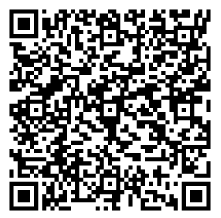

# (APPENDIX) Appendix {-}

# QR Codes {#qr-codes}

## Chapter 1

|                                                                                                                                                                                     |                                                                                                                                                                                           |                                                                                                                                                                   |
|-------------------------------------------------------------------------------------------------------------------------------------------------------------------------------------|-------------------------------------------------------------------------------------------------------------------------------------------------------------------------------------------|-------------------------------------------------------------------------------------------------------------------------------------------------------------------|
|                                                                                                                                                                                     |                                                                                                                                                                                           |                                                                                                                                                                   |
| [Research Question: Video](#chap01-video-research-questions)                                                                                                                        | [Meta-Analysis: Video](#chap01-video-meta-analysis)                                                                                                                                       | [Open Science: Video](#chap01-video-open-science)                                                                                                                 |
|                       |                                     |                 |
| [Glossary: Accordion](#chap01-glossary-accordion)                                                                                                                                   | [Glossary: Dialog Cards](#chap01-glossary-dialog-cards)                                                                                                                                   | [Glossary: Drag words](#chap01-glossary-drag-words)                                                                                                               |
|                                                  |                                                 |                             |
| [Glossary: Memory Game](#chap01-glossary-memory-game)                                                                                                                               | [Glossary: Fill-in-the-Blanks](#chap01-glossary-fill-in-the-blanks)                                                                                                                       | [Glossary: Flash Cards](#chap01-glossary-flash-cards)                                                                                                             |
|                                            |                            |                         |
| [Poll Intuitions: True/False](#chap01-poll-intuitions-true-false)                                                                                                                   | [Research Process: Drag & Drop](#chap01-research-process-drag-n-drop)                                                                                                                     | [Sketch Research: Form Wizard](#chap01-sketch-research-form-wizard)                                                                                               |
|                         |                      |     |
| [Research Process: Summary](#chap01-research-process-phases-summary)                                                                                                                | [Estimation Plan: Image Sequencing](#chap01-estimation-plan-image-sequencing)                                                                                                             | [Estimation Plan: Summary](#chap01-estimation-plan-summary)                                                                                                       |
|                                |                       |                 |
| [Explore Forest Plot: Info Hotspots](#chap01-forest-plot-info-hotspots)                                                                                                             | [Point Estimates in Forest Plot: Find Hotspots](#chap01-find-point-estimates-find-hotspots)                                                                                               | [Reporting: Accordion](#chap01-reporting-accordion)                                                                                                               |
|     |     |                              |
| [Quiz 1 (Question Set)](#chap01-quiz-1)                                                                                                                                             | [Quiz 2 (Question Set)](#chap01-quiz-2)                                                                                                                                                   | [Take-Home Messages (Summary)](#chap01-take-home-messages)                                                                                                        |
|                                                                                      |                                                                                            |                                |
| [Assessment (Question Set)](#chap01-assessment)                                                                                                                                     | [Steps of the Research Process (LearnR)](#chap01-steps-learnr)                                                                                                                            |                                                                                                                                                                   |
|                                                                                |                                                                           |                                                                                                                                                                   |

## Chapter 2

|                                                                                                                                                                                  |                                                                                                                                                                                    |                                                                                                                                                                                           |
|:--------------------------------------------------------------------------------------------------------------------------------------------------------------------------------:|:----------------------------------------------------------------------------------------------------------------------------------------------------------------------------------:|:-----------------------------------------------------------------------------------------------------------------------------------------------------------------------------------------:|
|                                                                                                                                                                                  |                                                                                                                                                                                    |                                                                                                                                                                                           |
|                                                        [Research Fundamentals: Video](#chap02-video-research-fundamentals)                                                       |                                                                  [Glossary: Accordion](#chap02-glossary-accordion)                                                                 |                                                                  [Glossary: Dialog Cards](#chap02-glossary-dialog-cards)                                                                  |
|    |                                                 |                                               |
|                                                            [Glossary: Drag Words I](#chap02-glossary-drag-words-part1)                                                           |                                                            [Glossary: Drag Words II](#chap02-glossary-drag-words-part2)                                                            |                                                                   [Glossary: Flash Cards](#chap02-glossary-flash-cards)                                                                   |
|                                      |                                       |                                                  |
|                                                        [Glossary: Fill in the Blanks](#chap02-glossary-fill-in-the-blanks)                                                       |                                                   [Sample & Population: Drag & Drop](#chap02-sample-and-population-drag-and-drop)                                                  |                                                                         [DFY: Drag Words](#chap02-DFY-drag-words)                                                                         |
|                    |    |                                                                                |
|                                                           [Measurement: Drag & Drop](#chap02-measurement-drag-and-drop)                                                          |                                                         [Measurement: Multiple Choice](#chap02-measurement-multiple-choice)                                                        |                                                  [Important Concepts 1: Advanced Dropdown](#chap02-important-concepts1-advanced-dropdown)                                                 |
|                              |                      |     |
|                                                [Important Concepts 2: Advanced Blank](#chap02-important-concepts2-advanced-blanks)                                               |                                                           [Reporting: Advanced Blanks](#chap02-reporting-advanced-blanks)                                                          |                                                                           [Quiz 1: Question Set](#chap02-quiz-1)                                                                          |
|     |                       |                                                                                        |
|                                                                      [Quiz 2: Question Set](#chap02-quiz-2)                                                                      |                                                                       [Quiz 3: Question Set](#chap02-quiz-3)                                                                       |                                                                      [Take-Home Messages: Summary](#chap02-take-home)                                                                     |
|                                                                     |                                                                        |                                                |
|                                                                                                                                                                                  |                                                                   [Assessment: Question Set](#chap02-assessment)                                                                   |                                                                                                                                                                                           |
|                                                                                                                                                                                  |                                                            |                                                                                                                                                           
