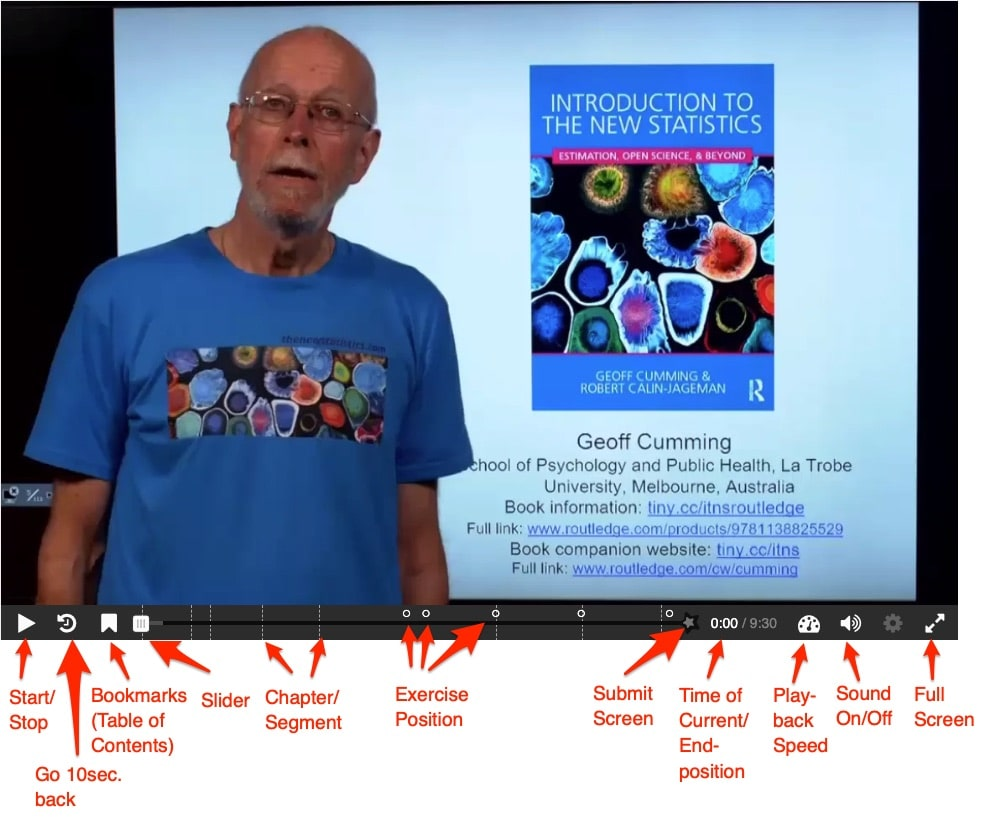

# H5P Content types

## Interactive Video {#help-interactive-video}


```{r label='help-video', fig.align='center', out.width="80%", echo=FALSE}

```
<center><small>**Figure B:** _Mapping of my three learning modes with the cognitive processes of the Anderson-Krathwohl taxonomy_</small></center>
