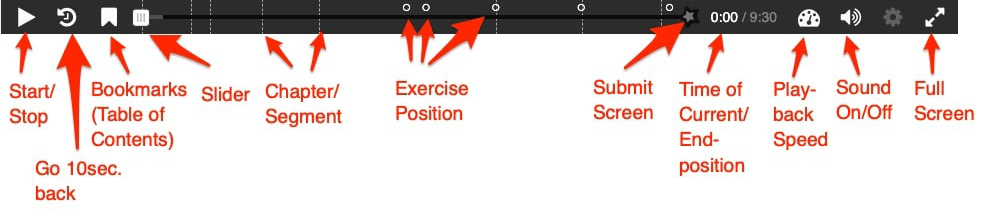

# H5P Content types

## Interactive Video {#help-interactive-video}


```{r label='help-video', fig.align='center', out.width="80%",echo=F, fig.cap='Control Strip for h5p-Modul "Interactive Video"'}

```
