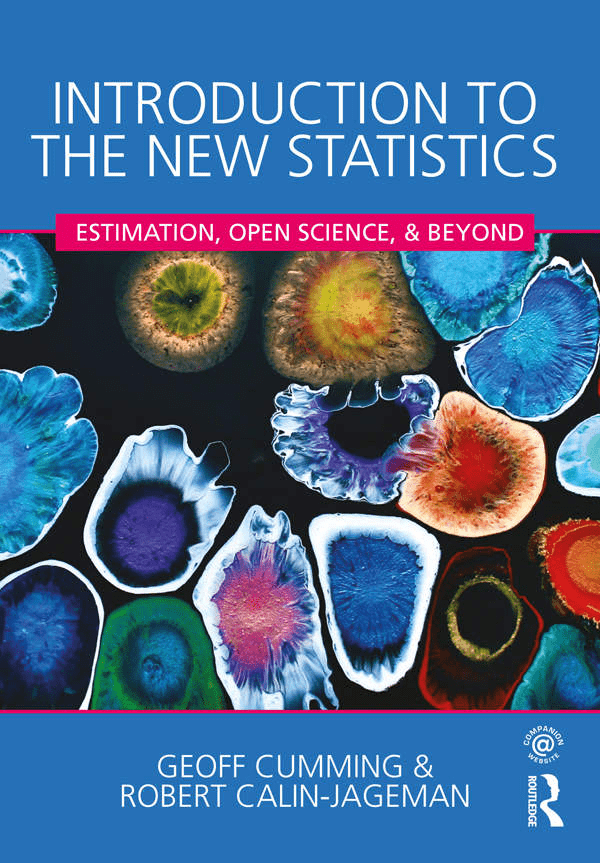

# itns-solutions

This website [itns-exercises](https://bookdown.org/pbaumgartner/itns-exercises/) is an interactive companion book for [Introduction to the New Statistics](https://www.routledgetextbooks.com/textbooks/9781138825529/) (abbreviated <i>itns</i>). It offers 

+ interactive quizzes with solutions
+ R tutorials for the end-of-chapter exercises 

Published so far are exercises for chapter 1-4: https://bookdown.org/pbaumgartner/itns-exercises/

Chapter 3 and 4 are already published as a stand alone version

* https://rpubs.com/pbaumgartner/itns-03
* https://rpubs.com/pbaumgartner/itns-04
  

