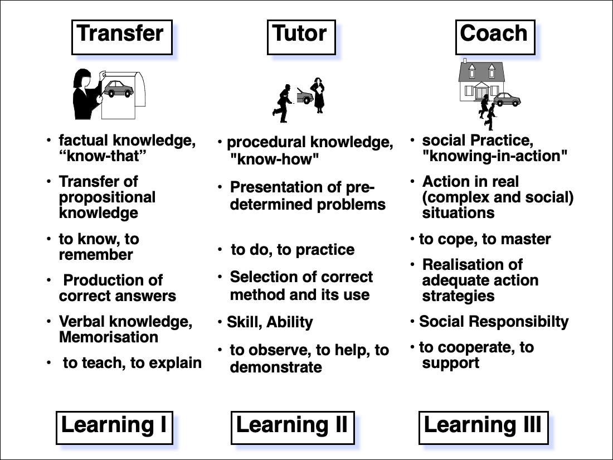
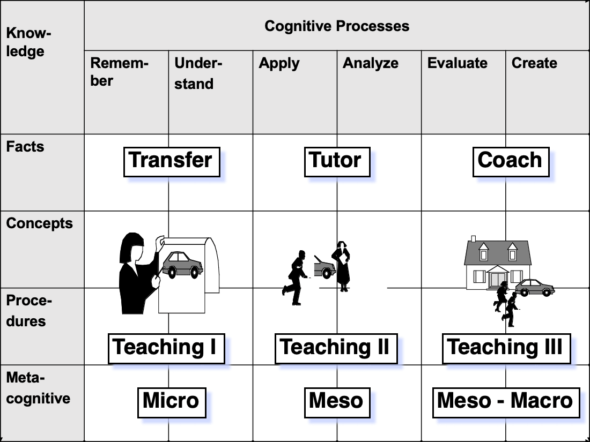

--- 
title: "Exercises for 'Introduction to The New Statistics'"
author: "Peter Baumgartner"
date: "`r Sys.Date()` - Work in progress: Finished about 20%"
colorlinks: yes
cover-image: img/chap00/cover-itns-min.png
bibliography:
- itns.bib
- packages.bib
description: This website is a companion book for [Introduction to the New Statistics](https://www.routledgetextbooks.com/textbooks/9781138825529/)
  (abbreviated <i>itns</i>). It offers interactive exercises developed mostly in [H5P](https://h5p.org) but also with [learnr](https://rstudio.github.io/learnr/) and [shiny](https://shiny.rstudio.com/). It also contains an R tutorial for the end-of-chapter exercises of <i>itns</i>.
documentclass: book
github-repo: petzi53/itns-exercises
link-citations: yes
site: bookdown::bookdown_site
biblio-style: apalike
---


# Preface {-}


```{r label='cover-picture', fig.align='center', out.width=450, echo=FALSE, fig.link='https://bitly.com/pb-itns'}
knitr::include_graphics('img/chap00/cover-itns-min.png', dpi = NA)
```

This interactive book is a companion book for [Introduction to the New Statistics](https://www.routledgetextbooks.com/textbooks/9781138825529/) (abbreviated <i>itns</i>). The two types of additional material it offers are:

+ interactive exercises with solutions, 
+ R tutorials for the end-of-chapter exercises.

## Interactive Exercises {-}

I have built the interactive exercises in this book with [H5P.org](https://h5p.org/). H5P stands for **H**TML**5** **P**ackage, a free and open-source content collaboration framework based on JavaScript. With H5P, it is easy for everyone to display, create, share, and reuse interactive HTML5 content through a standard browser. At the moment (July 2020), there are 47 different kinds of exercises ("content types" in H5P parlance). 

H5P content can be injected in any platform that supports embedded content (iframes). There exist already integrations for Learning Management Systems like [Canvas](https://www.instructure.com/canvas/), [Brightspace](https://www.d2l.com/products/), [Blackboard](https://www.blackboard.com/), [Moodle](https://moodle.org/) and other systems that support the standard for [**L**earning **T**ools **I**nteroperability](https://www.imsglobal.org/activity/learning-tools-interoperability) (See also: [How LTI works](https://www.imsglobal.org/basic-overview-how-lti-works)). In addition H5P has plugins developed for [WordPress](https://wordpress.org/plugins/h5p/), [Moodle](https://moodle.org/plugins/mod_hvp), [Drupal](https://www.drupal.org/project/h5p) and several other publishing systems. If you don't want to manage your own platform as a developer of interactive exercises you can also pay $57/month using [H5P.com](https://h5p.com/) **s**oftware **a**s **a** paid *s*ervice (SaaS).

I am using my German WordPress blog [Gedankensplitter](https://peter.baumgartner.name) with the required free H5P-plugin to develop interactive content presented in this book. I have tested these exercises at the backend site of my WordPress installation and --- if they work as intended --- I have published them here into the R-publishing system [bookdown](https://bookdown.org/yihui/bookdown/) via embedded code generated by the H5P WordPress plugin. As bookdown is built on top of [R Markdown](https://rmarkdown.rstudio.com/), it is very suitable also to include the R tutorial.

Even if the technical handling process of developing interactive content with H5P is documented excellently and therefore relatively quickly done, there is another --- more educational --- difficulty. What kind of exercises are valuable to learn the content presented in **I**ntroduction to **T**he **N**ew **S**tatistics (itns)? 

Yes, there are some quizzes included in the book which one "only" has to transfer into H5P content. With the quotations marks around "only," I want to address some difficulty resulting from converting static textual exercises into dynamic computer evaluated interactions. So, for instance, it is quite laborious to design the right solution for open-ended answers. But besides this technical problem, there is also the more pressing issue to create valuable _educational_ interactions with the tools provided by H5P.

Instead of using just traditional educational interactions on the web (most notably multiple-choice and fill-the-gap), I have experimented with _a wide variety of different types of exercises_. Furthermore, I have applied the concept of _multiple representations_ by developing various tasks for the same content.

## R Tutorial {-}

The second component of this companion book to _itns_ is a demonstration of how to carry out the statistical challenges presented in the end-of-chapter exercises using the programming language [R](https://www.r-project.org/), a free, open-source software environment for statistical computing and graphics. This part of the book is a tutorial. It applies R not only for the statistical analysis and visualization but also for other necessary practical tasks like data cleaning, data transformation, and data modeling. 

I assume some basic knowledge with the R language as I will not explain installation procedures and basic R commands. I am using [RStudio](https://rstudio.com/products/rstudio/download/), the prevalent free integrated development environment (IDE), and occasionally I mention RStudio specifics. But these hints are rare and not essential to understand and to replicate my suggested R procedures.

I will conclude this section with a warning: I was intrigued by _itns_ as a new generation of a statistical textbook. Criticizing the standard null hypothesis significance testing (NHST) using the estimation approach based on confidence intervals (CIs), meta-analysis, and integrating Open Science met my thinking and preferences.  But the truth is: I am neither a statistical expert nor an R wizard! My professional background is in instructional design and technology-enhanced learning (TEL). Therefore mainly, the instructional design of the exercises is the area where I am an expert. With the statistical content used by those exercises, I am not so experienced. As a sociologist, I had some statistical training, but this was about 35 years ago, and at that time, sophisticated tools like R were not available. 

Therefore I am using the challenge to write this book as my particular vehicle to learn and practice statistical analysis and the R programming language. In this sense, I am just another learner applying the elaboration technique so splendid and convincing explained in "_Make it stick: The science of successful learning_" [@brown_make_2014].

## Educational Considerations {-}

In _itns-solutions_, I have structured the sequence of exercises following three pedagogical concepts [@baumgartner_zen_2004]:

```{r figure-learning-modes, fig.align='center', out.width="80%", echo=FALSE}

```
<center><small>**Figure A:** _Learning modes and their different types of knowledge acquistion_</small></center>

### Learning Mode {-}

We can distinguish different learning modes. They are a specific way to get involved in the learning endeavor and must not be mixed up with learning styles. Whereas learning styles account for differences in individual learning, indicate learning modes different ways of how learning generally occurs.

There are different strategies to categorize learning modes. In contrast to [a very detailed classification](https://education.nsw.gov.au/teaching-and-learning/school-learning-environments-and-change/future-focused-learning-and-teaching/learning-modes), I prefer a division in only three broad categories. With a finely detailed distinction, you start to describe already concrete educational scenarios and not general essential aspects of learning.

Oriented on broad categories of cognitive processes, I distinguish grosso modo only three different learning respectively teaching types:

- **Learning I / Instruction:** Students acquire static knowledge from the presented content via reading, listening, and watching. The main cognitive task in this mode is memorizing and retrieving knowledge.
    
- **Learning II / Interaction:** Students acquire dynamic knowledge via exercises where they have to apply their static knowledge. To facilitate and stabilize their education, they get feedback on the results of their practice. The main cognitive task in Learning II is applying & analyzing specific situations.

- **Learning III / Construction:** Students create their knowledge by adapting and modifying learned procedures for challenging situations. Here the main cognitive task is incorporating skills into their body (performance) and insights into their personal experiences for mastering their life.
    
My three-part distinction of learning modes represents a hierarchy from more comfortable to more challenging learning modes. It conforms to the more detailed six differences of cognitive processes in the revised Bloom’sche taxonomy developed by Anderson, Krathwohl, and colleagues [@anderson_revising_2002; @krathwohl_revision_2002; @anderson_taxonomy_2000]: 

+ remember, understand (Learning I)
+ apply, analyze (Learning II)
+ evaluate, create (Learning III)


```{r label='figure-anderson-krahtwohl-taxonomy', fig.align='center', out.width="80%", echo=FALSE}

```
<center><small>**Figure B:** _Mapping of my three learning modes with the cognitive processes of the Anderson-Krathwohl taxonomy_</small></center>


### Multiple Representations {-}

In _itns-solutions_, I am applying the old but time-proven concept of _multiple representations_ [@ainsworth_functions_1999; @van_someren_learning_1998]: The same content is learned/experienced with several distinctive exercises. This approach is not entirely redundant as each activity addresses the brain capacity in different ways. Additionally, I sorted the same questions often differently. To give an example: I am using the same text to fill in the blanks from a prepared list of words, or via a dropdown menu (both are Learning II) and to write the correct concept without help (Learning III).

### Self-Determined Learner {-}

I developed all exercises with self-detemined respecticvely self-directed learners in mind [@ryan_self-determination_2018; @deci_handbook_2008; @knowles_self-directed_1975; @mezirow_critical_1985]. Learners should solve the task to their likening. I chose the educational settings toward the highest possible freedom supported by the software (H5P content type).

I will explain the details of my decisions in the [appendix](#h5p-content-types). But to summarize here, learners can choose the order of the exercises, repeat them as often as they want, and even view the solution before they start with the activity.  The idea behind this strategy of maximizing educational freedom is that adult self-learners don't want to fool themselves and are to respect in their self-organizing learning endeavor. There is one exception to the general rule of educational liberty: All activities under the sections _Assessment_ have somewhat limited freedom so that learners could get some overall feedback about their performance.

## Types of Exercises {-}


H5P is a potent tool with many different types of exercises ("content types" in H5P parlance). At the moment of this writing, I have uploaded 47 of these modules. But not every content type is appropriate for _itns-solution_.


The following table lists the 20 used content types, their functionality, and appearance in the chapter sections.

| Content Type             | Functionality                                       | Learning | Video | Glossary | Bulk | Recap | Assessment | R |
|--------------------------|-----------------------------------------------------|:--------:|:-----:|:--------:|:----:|:-----:|:----------:|:-:|
| Accordion                | Vertically stacked expandable items                 |     I    |       |     X    |      |       |            |   |
| Advanced Fill the Blanks | Missing word (dropdown & blanks)                    |  II,III  |       |     X    |   X  |       |            |   |
| Course Presentation      | Interactive slides                                  |  II,III  |       |          |      |       |      X     |   |
| Dialog Cards             | Text-based turning cards                            |     I    |       |     X    |      |       |            |   |
| Documentation Tool       | Form wizard with text export                        |    III   |       |          |   X  |       |            |   |
| Drag & Drop              | Drag & Drop with images                             |    II    |   X   |          |   X  |       |            |   |
| Drag the Words           | Drag & Drop with text                               |    II    |   X   |     X    |   X  |       |      X     |   |
| Fill in the Blanks       | Missing word (blanks)                               |    III   |   X   |          |      |       |      X     |   |
| Find Multiple Hotspots   | Many hotspots to find                               |    II    |   X   |          |   X  |       |            |   |
| Flash Cards              | Text and/or image based flash cards with repetition |    II    |       |     X    |      |       |            |   |
| Iframe Embedder          | Embed URL                                           |  II,III  |       |          |      |       |            | X |
| Image Hotspots           | Explore image hotspots                              |     I    |   X   |          |   X  |       |            |   |
| Image Sequencing         | Sort images                                         |    II    |       |          |   X  |       |            |   |
| Interactive Video        | Videos with educational interactions                |   I,II   |   X   |          |      |       |            |   |
| Mark the Words           | Highlight words in a text                           |    II    |   X   |          |   X  |       |      X     |   |
| Memory Game              | Image pairing                                       |    II    |       |     X    |      |       |            |   |
| Multiple Choice          | Single & multiple-choice questions                  |    II    |   X   |          |   X  |       |      X     |   |
| Question Set             | Sequence of various question types (Quiz)           |  II,III  |   X   |          |      |       |      X     |   |
| Summary                  | Choose correct statements                           |    II    |   X   |          |      |   X   |            |   |
| True/False Question      | True/false questions                                |    II    |   X   |          |   X  |       |      X     |   |


## Structure Of Chapter Exercises {-} 

I have grouped all exercises into a recurring structure of sections:

+ **Video:** Each chapter starts with one or several interactive videos. I have taken the videos from the [Routledge website](https://routledgetextbooks.com/textbooks/9781138825529/student.php).  The video exercises support Learning I (watching the video explanations) but also Learning II as they contain interactive activities too.
+ **Glossary:** To learn the glossary entries, I have provided several exercises ("multiple representations"). Learners do not need to practice all different types of activities. As there is a hierarchy in the level of difficulty, they could start with an exercise from level "Learning I" and continue immediately with one of the higher levels. Every glossary section follows the same pattern of exercise types:

    - Learning I: Accordion, Dialog Cards
    - Learning II: Drag Words, Flash Cards, Advanced Fill in the Blanks (dropdown menu)
    - Learning III: (Advanced) Fill in the Blanks (without help)<br /><br />


+ **Content:** Unter the next section, I summarize activities for the central part of the chapter covering the specific content parts students have to learn respectively to acquire. But instead of using the generic name "Content", I generated different names for this segment inspired by chapter subject and/or title. There is no fixed structure as the appropriate exercises depend on the topic presented. But generally, this part contains every conceivable suitable task. To better understand statistical concepts, this section also uses sometimes interactive visualizations developed with the [shiny](https://shiny.rstudio.com/) R packages. 

+ **Recap:** Every chapter has a section on reporting and a list of take-home messages. Students may recapitulate the central concepts of each chapter with the _Summary_-task (Learning II). The exercises for the reporting sections vary between the content types of _Accordion_ (Learning I), _Summary_ (Learning II), and _Advanced Fill in the Blanks_ or _Documentation Tool_  (Learning III). 

+ **Assessment:** Exercises under the _Assessment_ heading are somewhat different. They consist (similar to _Interactive Video_) of a pool of varying content types organized either by the content type _Question set_ (quizzes) or _Course Presentation_. 

    - _Question sets_ try to reconstruct the book quizzes, whereas _Assessments_ are collections to simulate the in-chapter and end-of-chapter exercises. My cautionary usage of the qualifying words "try" and "simulate" signals that all activities of _itns-solutions_ are an interactive online reconstruction of the book's practices. Interactive exercises via the internet have many advantages but also some disadvantages. So I had to reformulate some puzzles or even invent new question statements to get a bunch of challenging distractors learners could choose. 
    
    - In contrast to quizzes or _Question Sets_ – where learners have similar liberties as in other types of exercises – there are some restrictions in _Assessments_: If students want to inspect the solution of subsections they cannot retry only this part of the test, but have to repeat the whole quiz. At the end of an _Assessment_, learners will get overall feedback combined with a recommendation on how to proceed. 

+ **Interactive Demonstrations:** Starting with chapter 3, you will find in this section links to interactive statistical demonstrations written and designed with the [Shiny](https://shiny.rstudio.com/). These demonstrations are a big challenge for me as they need not only considerable (R-)programming knowledge but also experience with the appropriate R packages. Furthermore, I need a better infrastructure as I have a the moment with the free plan of [shinyapps.io](https://www.shinyapps.io/), which is limited to only five apps. --- Currently (July 2020), I have only finished the first draft of one of these demonstrations: [Picture Data](https://pbaumgartner.shinyapps.io/picture-data/) has similar functionality as the ESCI-software, which accompanies the book. But I think it has a better user interface, and I am also planning to supersede ESCI with the facility to load and store data.


+ **R Tutorial:** This last part of each chapter contains exercises to learn R. I have separated this part from the other chapter content as not all people want to get into the R programming language details. It contains three types of material:

   - There is an explicatory part showing the usage of R and its effects (Learning I). Mostly this section includes applications of the [LearnR](https://rstudio.github.io/learnr/) and [Shiny](https://rstudio.com/products/shiny/) packages.

    - Another part uses the LearnR packages for stand-alone R practices (Learning II).

    - Finally, there is a section where learners will find a complete R solution to the end-of-chapter exercises. Students who have already acquired some R programming knowledge should try to solve the book exercises by themself and compare their answers with my sample solutions (Learning III). 


## Conventions Used In This Book {-}

Most parts of this book consist only of headers, followed by the H5P exercises. Only in the R tutorial section, you will find textual explications. 

To facilitate the use of mobile phones, you will find QR codes in the [Appendix A](#qr-codes) for all exercises of the book sorted by chapter.

Colored paragraphs give you a visual overview of things to watch out:

```{block2, demo-checklist, type='rmdchecklist'}
This green-colored block summarizes crucial steps and is structured often as an ordered checklist.
```

```{block2, demo-download, type='rmddownload'}
The light blue block explains a download and/or installations procedure. It always refers to a download link.
```

```{block2, demo-info, type='rmdinfo'}
The dark blue block offers you some essential information, tip, or hint. 
```

```{block2, demo-inquiry, type='rmdinquiry'}
The black-colored block recommends further material and explains how to get this additional content. In the case of online-material, it provides the link.
```

```{block2, demo-warning, type='rmdwarning'}
The yellow-colored block tells you how to avoid troubles before it starts.
```

```{block2, demo-danger, type='rmddanger'}
The red-colored block explains error messages and how to recover from the problem.
```

The following conventions are taken from [Rmarkdown](https://bookdown.org/yihui/rmarkdown/software-info.html) [@Xie_Allaire_Grolemund_2018] another book written with _`bookdown`_.

+ There are no prompts (`>` and `+`) to R source code.
+ The text output is commented out with two hashes `##` by default. This is for your convenience when you want to copy and run the code. The text output will be ignored since it is commented out. 
+ Inline code and filenames are formatted in a typewriter font (e.g., `knitr::knit('foo.Rmd')`).
+ Package names are also formatted in a typewriter font but italic (e.g., _`rmarkdown`_).
+ Function names are followed by parentheses (e.g., `bookdown::render_book()`). The double-colon operator `::` means accessing an object from a package.


## Providing Feedback And Reportung Errors {-}

You can contact me via [my GitHub page](https://github.com/petzi53). Use the [repository of itns-solution](https://github.com/petzi53/itns-exercises) to report errors or to suggest modification with pull requests (PR). 


```{block2, warning-proficiency-github, type='rmdwarning'}
Be aware that I am still not very proficient with advanced functionalities of GitHub. I already did a few PR but never received one.
```


## General Setup {-}

**Global Options**

```{r label = "global-options", highlight=TRUE, collapse=TRUE}

### setting up working environment
### for details see: https://yihui.name/knitr/options/
knitr::opts_chunk$set(
        collapse = T,
        echo = T,
        message = T,
        error = T,
        warning = T,
        comment = '##',
        highlight = T,
        prompt = F,
        strip.white = T,
        tidy = T
        )

```


**Installing and loading R packages**


```{r installing-and-loading-R-packages}

### accompanying R package: https://github.com/gitrman/itns
if (!require("itns"))
        {remotes::install_github("gitrman/itns", 
                         build = TRUE, build_opts = c("--no-resave-data", "--no-manual"))
        library("itns")}


### https://www.tidyverse.org/
if (!require("tidyverse"))
        {install.packages("tidyverse", repos = 'http://cran.wu.ac.at/')
        library(tidyverse)}

### above command installed and loaded the core tidyverse packages:
# ggplot2: data visualisation
# tibble:  a modern take on data frames
# tidyr:   data tidying
# readr:   data import (csv, tsv, fwf)
# purrr:   functional R programming
# dplyr:   data (frame) manipulation
# stringr: string manipulation
# forcats: working with categorial varialbes


### to calculate mode:
if (!require("modeest"))
        {install.packages("modeest", repos = 'http://cran.wu.ac.at/')
        library(modeest)}

# I am going to use the `janitor` package for calculating table totals
if (!require("janitor"))
        {install.packages("janitor", repos = 'http://cran.wu.ac.at/')
        library(janitor)}

### install "checkr" to test code submissions in learnr (and potentially other) tutorials
### there is also a problem in line 639 in "vignettes/checkr.Rmd"
### I have changed version hoping that 0.6 is unsensible to the "older" CRAN version (0.4) and does not update
if (!require("checkr"))
        {remotes::install_github("petzi53/checkr2", 
                                 build = TRUE, build_opts = c("--no-resave-data", "--no-manual"))
        library(checkr)}

if (!require("itns"))
        {remotes::install_github("gitrman/itns", 
                         build = TRUE, build_opts = c("--no-resave-data", "--no-manual"))
        library("itns")}


```

**Theme adaption for the graphic display with `ggplot2`**

```{r generate-my-own-theme}

my_theme <- theme_light() +
        theme(plot.title = element_text(size = 10, face = "bold", hjust = 0.5)) +
        theme(plot.background = element_rect(color = NA, fill = NA)) +
        theme(plot.margin = margin(1, 0, 0, 0, unit = 'cm'))
```

